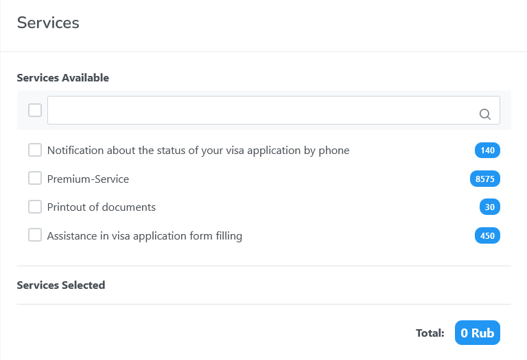

# Almaviva VAC auto appointment

[Switch to Russian README](https://github.com/codingoleg/Almaviva_VAC_auto_appointment/blob/master/README.ru.md)\
This script allows you to search for free spots and sign up at the visa 
application center to apply for a visa to Italy through the site 
https://ru.almaviva-visa.services. \
The script sends requests to the API and sees free spots, even if there are 
none on the site. (It was empirically established that, if these 'invisible' 
intervals exist, successful appointment is possible, but unlikely.)\
At present time the script can only apply 
for the touristic visa without any services (see the screenshots).
Applying for another visas' types and adding services is not included yet.\
\


## Installation
1. Clone this repo:
```bash
git clone https://github.com/codingoleg/Almaviva_VAC_auto_appointment.git
```
2. Go inside and install required Python libraries:
```bash
cd .\Almaviva_VAC_auto_appointment\
pip install -r requirements.txt
```

## Usage
1. Go to https://ru.almaviva-visa.services. In a popup window
carefully read the information about the city of your registration and click on
the corresponding link. If you stay on the same site, create an account. If you were redirected to https://italy-vms.ru/,
this script will not work for you.
2. Fill the variables in config.py:
+ City.\
List of available cities:
   + Москва
   + Краснодар
   + Екатеринбург
   + Нижний Новгород
   + Ростов-на-Дону
   + Новосибирск
   + Казань
   + Самара
+ Number of persons (1 or 2)
+ Start date to search from. Format: date(year, month, day)
+ Final date to search to (non inclusive). Format: date(year, month, day)
+ Username and password from https://ru.almaviva-visa.services
```python
# Example
REQUIRED_CITY = 'Самара'
NUMBER_OF_PERSONS = 1
START_DATE = date(2023, 6, 22)
FINAL_DATE = date(2023, 6, 29)
USERNAME = 'almaviva_username@gmail.com'
PASSWORD = 'almaviva_password'
```
3. Fill the CREDENTIALS_PERSON_1 with you credentials in capital letters.
If you appoint two persons, fill the CREDENTIALS_PERSON_2 
as well with the second person credentials.
```python
# Example
CREDENTIALS_PERSON_1 = {
    'name': 'IVAN',    
    'surname': 'PETROV',
    'passport': '123456789',
    'phone': '79261112233',
    'applicantEmail': 'ivan_petrov@gmail.com'
}
```
4. By default, the REQUIRED_TIME contains all time intervals.\
If you don't need all of them, edit the REQUIRED_TIME accordingly.
```python
# For example, you want to appoint to one of these time intervals:
# 9:00, 9:30, 10:00 or 14:30
REQUIRED_TIME = ('09:00', '09:30', '10:00', '14:30')
```
5. Run the script
```bash
python main.py
```
The process may take from a few seconds to several days depending on the free 
spots availability.\
If the appointment is successful, you will receive the message 'The appointment
was successfully created.', as well as the date and time of the appointment.

6. You can check your appointment via command
```bash
appointment.check_appointment()
```
or at https://ru.almaviva-visa.services/profile/appointment \


## Contributing
Bug reports or pull requests are welcome

## License
GNU GPLv3 