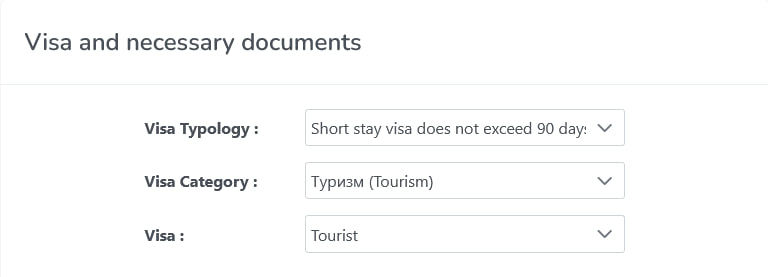
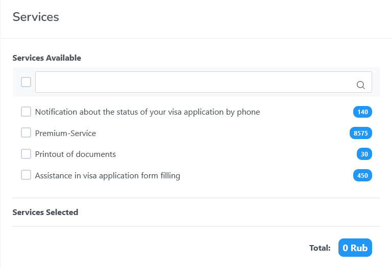
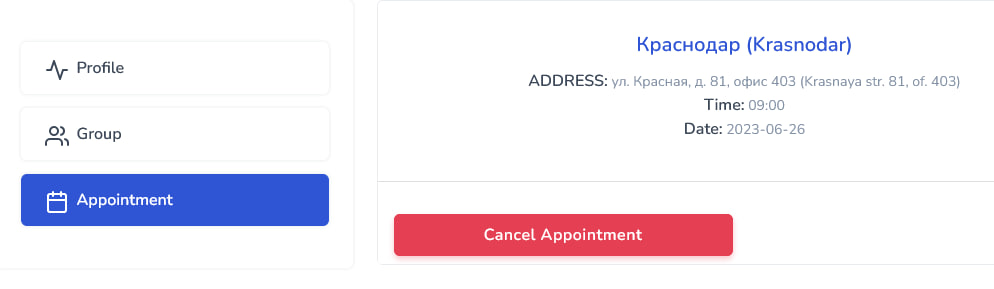

# Almaviva VAC auto appointment

Скрипт позволяет искать свободные места и регистрироваться в визовый центр для 
запроса визы в Италию через сайт https://ru.almaviva-visa.services. \
Скрипт посылает запрос по API и видит свободные места, даже если на сайте их 
нет. (Эмпирическим путем установлено, что при наличии таких "невидимых" мест 
успешная запись возможна, но маловероятна).\
В настоящее время скрипт запрашивает только туристическую визу без 
дополнительных услуг (см. скриншоты ниже) c оплатой наличными. Подача на другие
типы виз, оплаты и дополнительные услуги пока не предусмотрены.\
\


## Installation
1. Клонируйте репозиторий:
```bash
git clone https://github.com/codingoleg/Almaviva_VAC_auto_appointment.git
```
2. Перейдите в него и установите необходимые библиотеки Python:
```bash
cd .\Almaviva_VAC_auto_appointment\
pip install -r requirements.txt
```

## Usage
1. Зайдите на https://ru.almaviva-visa.services. Во всплывающем окне
внимательно прочитайте информацию о городе вашей регистрации и нажмите на
соответствующую ссылку. Если вы остались на том же сайте, создайте учетную 
запись. Если же вас перенаправило на https://italy-vms.ru/, 
данный скрипт вам не подойдет.
2. Присвойте значения переменным в config.py:
+ Город.\
Список доступных городов:
   + Москва
   + Краснодар
   + Екатеринбург
   + Нижний Новгород
   + Ростов-на-Дону
   + Новосибирск
   + Казань
   + Самара
+ Количество человек (1 или 2)
+ Стартовая дата для поиска. Формат: date(год, месяц, день)
+ Финальная дата для поиска (невключительно). Формат: date(год, месяц, день)
+ Имя пользователя и пароль с https://ru.almaviva-visa.services
```python
# Пример
REQUIRED_CITY = 'Самара'
NUMBER_OF_PERSONS = 1
START_DATE = date(2023, 6, 22)
FINAL_DATE = date(2023, 6, 29)
USERNAME = 'almaviva_username@gmail.com'
PASSWORD = 'almaviva_password'
```
3. Заполните CREDENTIALS_PERSON_1 вашими личными данными заглавными буквами.\
Если вы записываете двух человек, заполните таким же образом 
CREDENTIALS_PERSON_2 данными второго человека.
```python
# Пример
CREDENTIALS_PERSON_1 = {
    'name': 'IVAN',    
    'surname': 'PETROV',
    'passport': '123456789',
    'phone': '79261112233',
    'applicantEmail': 'ivan_petrov@gmail.com'
}
```
4. По умолчанию REQUIRED_TIME содержит все временные окна. Если вам не нужны 
все, отредактируйте REQUIRED_TIME соответствующим образом.
```python
# Например, вы хотите записаться на одно из этих временных окон: 
# 9:00, 9:30, 10:00 или 14:30.
REQUIRED_TIME = ('09:00', '09:30', '10:00', '14:30')
```
5. Запустите скрипт
```bash
python main.py
```
Процесс может занять от нескольких секунд до нескольких дней в 
зависимости от наличия свободных окон.\
Если запись пройдет успешно, вы получите сообщение 'The appointment was 
successfully created.', а также дату и время записи.

6. Вы можете проверить вашу запись командой
```bash
appointment.check_appointment()
```
или на https://ru.almaviva-visa.services/profile/appointment \


## Contributing
Баг репорты и пул реквесты приветствуются

## License
GNU GPLv3 